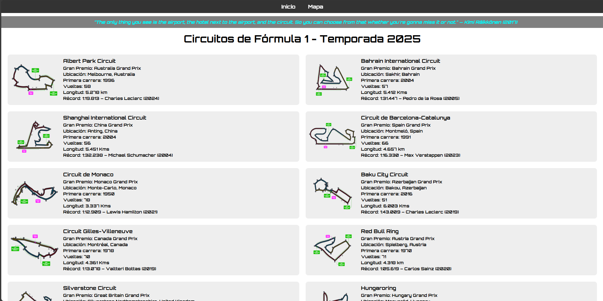
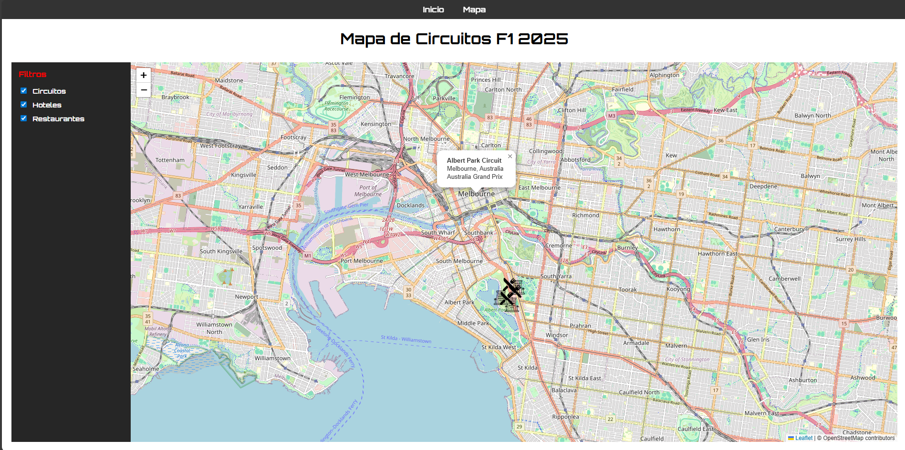
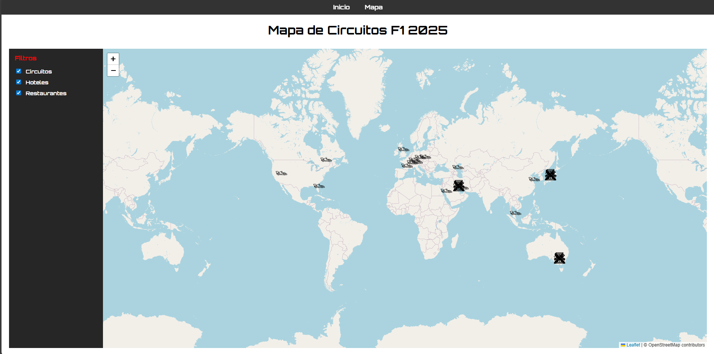

# F1 Tracks 2025

Web aplikazio batek 1 Formulako 2025 denboraldiko zirkuituak erakusten ditu eta, zirkuitu batean klik egitean, mapa interaktibo bat erakusten du, gertuko hotel eta jatetxeekin.

---

## Edukien taula

- [Helburua](#helburua)
- [Erabilitako teknologiak](#erabilitako-teknologiak)
- [Erabilitako datuak](#erabilitako-datuak)
- [Nola exekutatu aplikazioa](#nola-exekutatu-aplikazioa)
- [Aplikazioaren erabilera](#aplikazioaren-erabilera)
- [Proiektuaren egitura](#proiektuaren-egitura)
- [Harrapaketak](#harrapaketak)
- [Notak eta bug-ak](#notak-eta-bug-ak) 

---

## Helburua

Proiektu honen helburua 1 2025 Formulako zirkuituak esploratzeko modu bisual eta interaktiboa eskaintzea da, erabiltzaileei aukera emanez:

- Zirkuitu bakoitzari buruzko oinarrizko informazioa kontsultatu (izena, kokapena, itzulerako errekorra, itzuliak, luzera, lehen lasterketa, Sari Nagusia).
- Zirkuituaren kokapena mapa batean bistaratzea.
- Zirkuitu bakoitzetik hurbil dauden hotelak eta jatetxeak esploratzea.
- Elementuak mapan bisualki iragaztea geruzen bidez: zirkuituak, hotelak eta jatetxeak.
- Kimi Räikkönenen aipamen dibertigarriak erakutsi nabigatzen ari den bitartean.

---

## Erabilitako teknologiak

- **HTML5** y **CSS3** egitura eta diseinurako.
- **JavaScript (ES6 Modules)** aplikazioaren logikarako.
- **GSAP** animazio leunetarako, zirkuituak eta hitzorduak kargatzean.
- **Leaflet.js** mapa interaktiboetarako.
- **OpenStreetMap** mapako oihaletarako eta hirien geokodifikaziorako.
- **APIs externas**:
  - [API de Fórmula 1](https://www.api-football.com/) zirkuituen datuak lortzeko.
  - [API de Kimi Quotes](https://kimiquotes.pages.dev/api/quote) esaldiak erakusteko.
- **JSON local** hotel eta jatetxeetarako zirkuituko.

---

## Erabilitako datuak

- **Circuitos de F1 2025**:  F1eko APItik lortutakoak, zerrendarekin iragazita `circuitsList.js`.
- **Hoteles y restaurantes**: JSON lokalak (`hotels.json` y `restaurants.json`) zirkuitu bidez antolatuak.
- **Geocodificación**: OpenStreetMap-eko Nominatimen API, hiria eta herrialdea koordenatu bihurtzeko.

---

## Nola exekutatu aplikazioa

1. Biltegi hau klonatu edo deskargatu.
2. Ziurtatu zure F1eko `API` gakoa `API_KEY` gisa `config.js` duzula (adibidez: API_KEY = "TuCodigoDeApi").
3. Nabigatzaile batean, `index.html` irekitzen du.
4. Egin klik edozein zirkuitutan mapa interaktibora nabigatzeko.

> ⚠️ Oharra: Kanpoko CORS eta APIen mugak direla eta, VSCode `LiveServer` zerbitzari lokala erabiltzea gomendatzen da.

---

## Aplikazioaren erabilera

1. **Página principal (`index.html`)**:
   - Se muestran todos los circuitos de la temporada 2025.
   - Cada bloque muestra:
     - Imagen del circuito
     - Nombre del circuito
     - Gran Premio
     - Ubicación (ciudad y país)
     - Primera carrera
     - Número de vueltas y longitud
     - Récord de vuelta
   - Al hacer clic en un circuito, se redirige a `map.html` con el circuito seleccionado.

2. **Mapa interactivo (`map.html`)**:
   - Si se selecciona la pagina de mapa sin seleccionar un circuito se muestra el mapa con todos los ciruitos, restaurantes y hoteles
   - Si se selecciona el circuito desde la pagina principal se muestra un mapa centrado en el circuito seleccionado.
   - Capas y filtros:
     - Circuitos
     - Hoteles
     - Restaurantes
   - Cada marcador es clicable y muestra un popup con información detallada.
   - Puedes activar o desactivar cada capa desde el panel lateral.

---

## Proiektuaren egitura

```text
F1-Tracks-2025/
│
├─ index.html
├─ map.html
├─ css/
│   └─ styles.css
├─ js/
│   ├─ config.js <- Este archivo no está incluido, se debe añadir utilizando una API key propia de [ApiSports](https://www.api-sports.io/)
│   ├─ circuits.js
│   ├─ circuitsList.js
│   ├─ map.js
│   └─ quote.js
├─ data/
│   ├─ hotels.json
│   └─ restaurants.json
├─ img/
│   ├─ favicon.png
│   ├─ f1.png
│   ├─ hotel-icon.png
│   └─ restaurant-icon.png
└─ README.md
```


---

## Harrapaketak

### Página principal – Listado de circuitos F1 2025


En esta vista se muestran todos los circuitos de la temporada 2025 de Fórmula 1 con información detallada y animaciones.

---

### Mapa interactivo – Circuitos, hoteles y restaurantes



Mapa interactivo basado en Leaflet donde se puede visualizar el circuito seleccionado junto a hoteles y restaurantes cercanos, con filtros por capas.
Si no se selecciona ningun mapa se mostrara el mapa completo.

---

## Notak eta bug-ak

- Algunas APIs externas pueden limitar la cantidad de peticiones por día.
- Nombres de circuitos pueden variar y no coincidir con la lista interna, por lo que algunos circuitos pueden no mostrarse.
- Algunos circuitos pueden no estar correctamente colocados en el mapa.

---

Creado por Mikel Corrales
